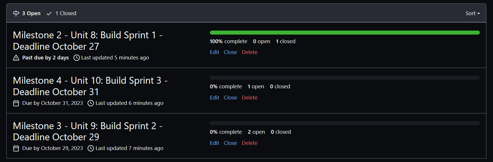

# Milestone 1 - Pet Shelter (Unit 7)

## Table of Contents

1. [Overview](#Overview)
1. [Product Spec](#Product-Spec)
1. [Wireframes](#Wireframes)

## Overview

### Description

Allows users to search for pets using phone location to determine available pets. Users can create lists of pets and shelters to shortlist. Further information on pet care, pet items, health, etc. can be displayed on a feed

### App Evaluation

  * **Description:**  Allows users to search for pets using phone location to determine available pets. Users can create lists of pets and shelters to shortlist. Further information on pet care, pet items, health, etc. can be displayed on a feed
  * **Category:** Pets
  * **Mobile:** This app would be viable in both a mobile or desktop application. Albeit, in mobile form, a user can lookup information casually
  * **Story:** Helps users to categorize their searches or needs in the pet adoption process by creating lists and presenting search information in a friendly and accessible manner
  * **Market:** Any user that is looking into adopting a pet or researching a shelter
  * **Habit:** The app can be used as often as the adoption process is ongoing or afterwards to lookup shelter information
  * **Scope:** V1 would allow users to create lists and their profiles. V2 would integrate shelter API to bring in pet and shelter information. V3 would display additional tips on managing the adoption process and other pet/shelter information. Potential to integrate related APIs from Amazon, Rover, and adoption websites. V4 can set-up adoption families with pet playdates and socialization

## Product Spec

### 1. User Features (Required and Optional)

**Required Features**

1. Ability to search for animals based on a location property(zip code, (lat, long), or address) from API
2. Store selected animals from API call to database
3. Display stored pets from database

**Optional Features**

1. Create a dark mode

### 2. Screen Archetypes

- Animal Seach screen
  - has a bottom navigation menu
  - can use searchbar to initiate API search
- Stored animal screen
  - Displays any saved animals from search
  - has a bottom navigation menu

### 3. Navigation

**Tab Navigation** (Tab to Screen)

* Animal search tab
* Stored animal tab

**Flow Navigation** (Screen to Screen)

- Home screen defaults to Animal search tab with bottom navigation menu
  - Can go to Saved animal feed
- Stored animal screen with bottom navigation menu
  - Can navigate back to Animal search screen
  
## Wireframes

 

 

 

# Milestone 2 - Build Sprint 1 (Unit 8)

## GitHub Project board

## Issue cards

- 

## Issues worked on this sprint

- Connect to Petfinder API
- 

 

# Milestone 3 - Build Sprint 2 (Unit 9)

## GitHub Project board

## Issue cards

- 

## Issues worked on this sprint

- Display available animals after calling API on location
- 

## Completed user stories

- Connect to Petfinder API
- Display available animals after calling API on location
-
-
- Pending: Add dark mode [Optional]

[Add video/gif of your current application that shows build progress]

## App Demo Video

- No presentation required for demo project. ❌
